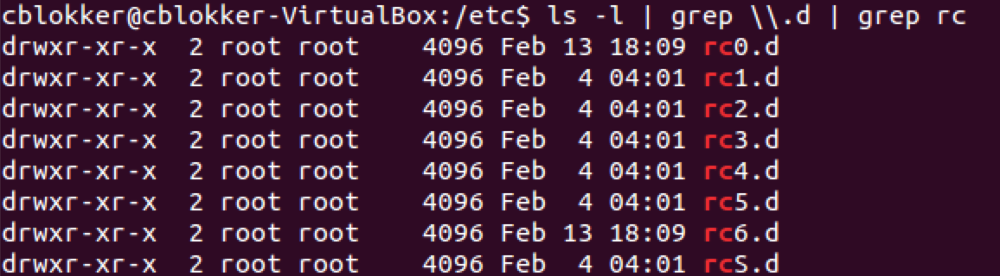
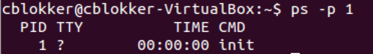
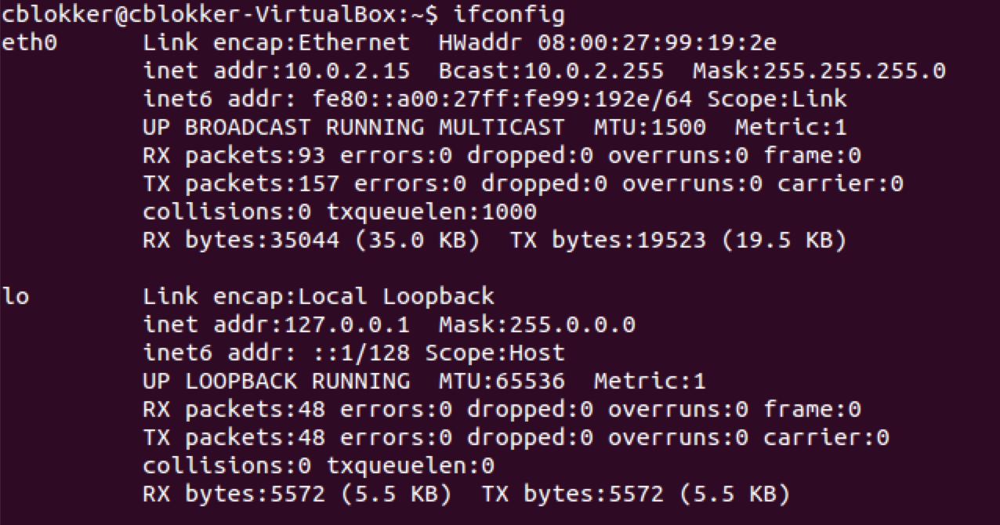
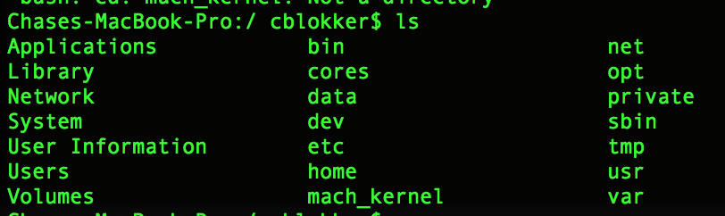
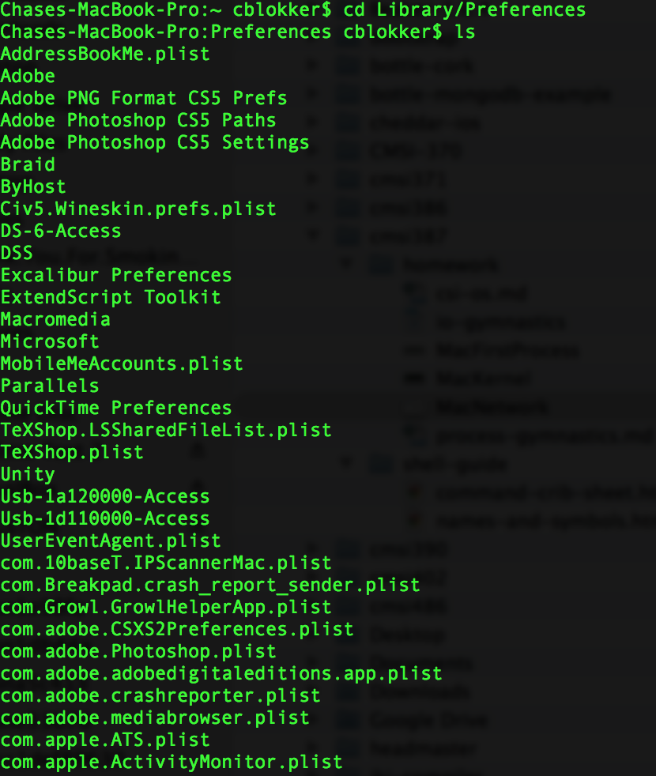
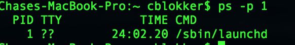
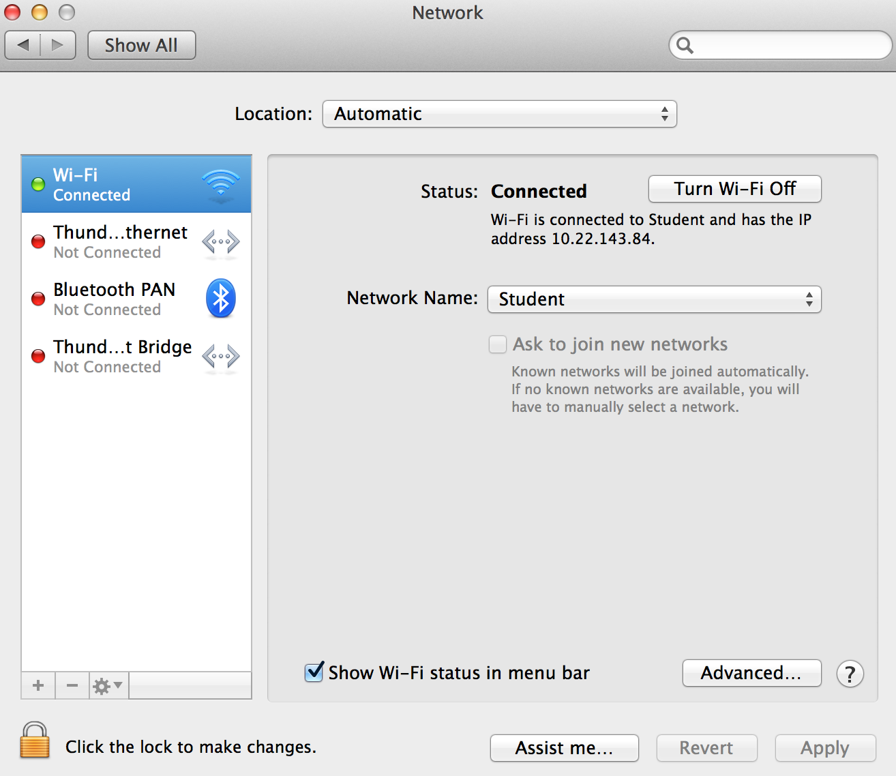

##CSI-OS

### Linux

#### Pre-OS software

#### Kernel file

#### Startup scripts and/or configuration files

#### The "first" process

#### Network settings

### Mac OS X

#### Pre-OS software

#### Kernel file

#### Startup scripts and/or configuration files

#### The "first" process

#### Network settings

### Windows

#### Pre-OS software

#### Kernel file

#### Startup scripts and/or configuration files

#### The "first" process

#### Network settings

