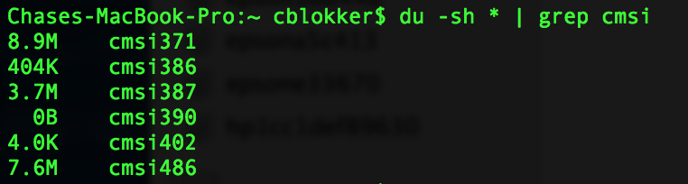

###io-gymnastics

#### 1. Create an ssh tunnel from this computer to a service that is visible from another ssh-capable computer (but, of course, not necessarily visible from the computer you’re using). Then, access that service from your computer through localhost and the tunneled port number.

#### 2. Run something lengthy (ping, vm_stat/vmstat, loooooong download, finding the quadrillionth prime number…) inside screen; logout of that computer entirely, login again, and reconnect to screen to prove to yourself that the process has continued to run without interruption.

#### 3. Learn how to use du, which tells you how much disk space you’re using in a given directory.

##### a)  Which first-level subdirectory in ~ is taking up the most space? Submit the command that includes this information in as little output as possible.

##### b)  Submit a command that displays only the disk usage of directories matching some regular expression. Hint: |.

#### 4.  On a Keck lab machine, create a file within ~. Run ls -i to determine that file’s inode number. Move this file to another directory inside ~, then move it to /tmp, then move it back to your home directory. After each move, use ls -i to see its inode number.

##### a)  Submit the output of ls -i both right after you created the file and after each file move.

##### b)  Submit the piped commands that you would type in order to filter out all lines of ls -i’s output except for the file that you created.

#### 5.  Pop a few storage devices (CD, DVD, flash drive, network drive, etc.) into your computer. Figure out the mount points for each device.

